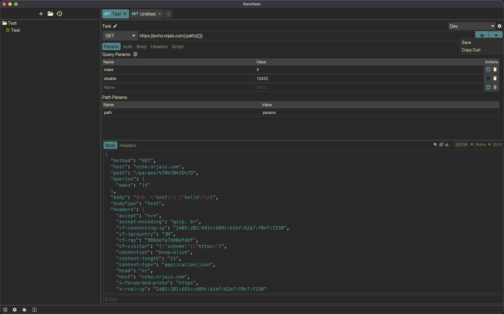

# Sanchaar - A Offline REST API client

Sanchaar is a offline REST API client built using Iced in Rust. It is a simple tool to test REST APIs without the need of internet connection. It supports GET, POST, PUT, DELETE requests with path, query and header parameters.

## Screenshot

## Features

- Send GET, POST, PUT, DELETE requests
- Path, Query, Header params
- Multiple requests in tabs
- Save/Load requests from collections
- Create/Open collection from local disk

## Todo

- [ ] Move requestst to `requests` dir instead of root

## Roadmap

- [x] Path param support
- [x] Query param support
- [x] Header param support
- [ ] Body support
  - [x] JSON
  - [x] Form
  - [x] XML
  - [ ] Multipart
- [x] Request cancellation
- [x] Tab view for multiple requests
- [ ] File persistence
  - [x] TOML file format
  - [x] Save/Load
  - [ ] Changed indicator
  - [x] File Rename
- [ ] Collections/Folder
  - [x] Tree view
  - [x] Create/Open
  - [ ] Remove/Update
  - [x] Auto Save/Load
  - [ ] Export/Import
- [ ] Environments
  - [ ] Add/Remove/Update
  - [ ] Choose environment
  - [ ] Auto Save/Load current state
- [ ] Code export
- [ ] History
  - [ ] Save/Load
  - [ ] Auto Save/Load
- [ ] Scripting
  - [ ] Pre request
  - [ ] Post request
- [ ] Mock APIs
- [ ] CLI
  - [ ] Run request by path
  - [ ] Select environment by name
  - [ ] Run tests by path
  - [ ] Run all collection tests
